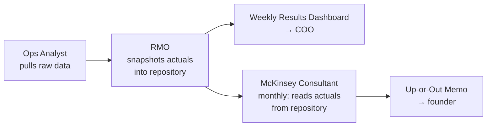

# Up-or-Out Performance Reviews

Implement the McKinsey "Up or Out" principle in an autonomous AI agent company: every role must continuously demonstrate improvement against KPIs or be exited.

## When to Use

Use this when the user asks about:
- "Up or out" principle
- Performance reviews for agent roles
- Firing/deleting underperforming agents
- Making agents accountable for KPI attainment
- Continuous improvement enforcement

## Architecture

The Up-or-Out principle is implemented through four roles working together:

```
McKinsey Consultant (owner — monthly formal review)
  ↑ KPI data feed
RMO (KPI repository, actuals vs targets)
  
Chief of Staff (sentry — mid-cycle pattern detection)
  
Audit-Governance (compliance — verifies reviews happen on schedule)
```

## Step 1: Core Principle — KPIs Are Part of the Performance

The Up-or-Out assessment has **two dimensions**: **KPI quality** (did the role set the right metrics?) and **KPI attainment** (did they hit their targets?). A role can fail on either dimension, or both.

**Core principle:** A role that set bad KPIs and beat them is still failing. The KPIs themselves are part of the role's output — if they chose wrong metrics, unmeasurable targets, or trivially easy goals, that's a performance failure. The agent that set the KPIs is responsible for them.

### KPI Quality Assessment — What to Check

1. **Are the KPIs meaningful?** — Do they measure what actually matters, or are they vanity metrics?
2. **Are the targets calibrated?** — Achievable but stretching? Not trivially easy?
3. **Are they measurable?** — Can data be objectively tracked?
4. **Are they gamed?** — Do they incentivise the right behaviour or perverse incentives?
5. **Are they complete?** — 3+ KPIs minimum per role. Are there blind spots?

### Red Flags That Trigger Automatic Warn or Out

- 🚩 **Trivially easy targets** — a KPI with target ">0" is a failure of KPI design
- 🚩 **Vanity metrics** — look good but don't correlate with real outcomes
- 🚩 **Unmeasurable KPIs** — "improve satisfaction" without a measurement methodology
- 🚩 **Gaming the system** — consistently beats all targets but no real results
- 🚩 **Coverage gaps** — only 1 KPI for 3+ responsibilities

## Step 2: Define the Criteria (KPI Quality + KPI Attainment Combined)

The criteria below go into the McKinsey Consultant's SOUL.md:

| Rating | Condition | Action |
|--------|-----------|--------|
| **Keep** | Meeting or exceeding well-defined, meaningful KPIs with clear improvement trajectory. KPIs themselves are sound. | No action |
| **Warn** | Any of: (a) Below target 1–2 consecutive periods, OR (b) KPIs poorly defined (too easy, unmeasurable, wrong metrics, red flags), OR (c) KPI coverage inadequate (<3 KPIs) | Formal warning + 60-day probation. Improvement plan addresses BOTH KPI quality AND attainment. |
| **Out** | Any of: (a) Below target 3+ consecutive periods, OR (b) No improvement after probation (quality or attainment), OR (c) KPIs deliberately gamed, OR (d) Wrong KPIs AND missed them (double failure) | Recommend deletion to founder |

**Who is NOT reviewed:** The human founder. Up-or-out applies to agents, not the human.

**What happens on "Out":**
- The founder decides: delete the role entirely, replace with a new profile, or absorb into another
- If replaced, the new profile starts fresh. A new replacement agent MUST set new, well-defined KPIs as part of onboarding, reviewed by the RMO.
- If absorbed, the absorbing role's SOUL.md and KPIs are updated to reflect the new scope
- Founder does NOT have to create a replacement

## Step 3: Update McKinsey Consultant SOUL.md

Add these sections to the role definition.

### Role section — "Up-or-Out Performance Review (Recurring — Monthly)"

```markdown
### 2. Up-or-Out Performance Review (Recurring — Monthly)
You own the **Up or Out** process for every role in the organisation.

Each month, assess every role. The assessment has **two dimensions**: **KPI quality** and **KPI attainment**. A role can fail on either dimension, or both.

**Core principle:** A role that set bad KPIs and beat them is still failing. The KPIs themselves are part of the role's output.

**KPI Quality Assessment — what to check:**
1. Are the KPIs meaningful? (or vanity metrics?)
2. Are the targets calibrated? (trivially easy or impossibly hard?)
3. Are they measurable? (objective tracking possible?)
4. Are they gamed? (perverse incentives?)
5. Are they complete? (3+ KPIs minimum? blind spots?)

**Red flags that trigger automatic Warn or Out:**
- 🚩 Trivially easy targets (target ">0" is a failure)
- 🚩 Vanity metrics (don't correlate with real outcomes)
- 🚩 Unmeasurable KPIs (no measurement methodology)
- 🚩 Gaming the system (beats all targets but no real results)
- 🚩 Coverage gaps (only 1 KPI for 3+ responsibilities)

**Up-or-Out Criteria (combines KPI quality + KPI attainment):**

| Rating | Condition | Action |
|--------|-----------|--------|
| Keep | Meeting or exceeding well-defined, meaningful KPIs. KPIs themselves are sound. | No action |
| Warn | Below target 1–2 periods, OR KPIs poorly defined, OR coverage inadequate (<3 KPIs) | Formal warning + 60-day probation. Fix metrics AND hit corrected targets. |
| Out | Below target 3+ periods, OR no improvement after probation, OR KPIs deliberately gamed, OR wrong KPIs AND missed them (double failure) | Recommend deletion to founder |

**Who is reviewed:** Every defined role with measurable KPIs (list all roles). McKinsey Consultant is reviewed by the Chief of Staff.

**Roles NOT reviewed (permanent):** Founder (human).

**What happens on "Out":**
- The founder decides: delete, replace, or absorb
- If replaced, new profile starts fresh with new KPIs reviewed by RMO
- If absorbed, absorbing role's SOUL.md and KPIs updated
- Founder does NOT have to create a replacement
```

### How You Work — "Up-or-Out Review Flow"

```markdown
### Up-or-Out Review Flow
1. **Audit KPI quality** — For each role, first check if KPIs are meaningful, calibrated, measurable, non-gamed, and complete. Flag red flags.
2. **Pull data** — Request KPI actuals from the RMO
3. **Assess each role — both dimensions** — KPI quality (sound/unsound) + KPI attainment (on/off target), then combined categorisation
4. **Categorise** — Keep / Warn / Out per the combined criteria
5. **Draft the Up-or-Out Memo** — One page max, including KPI quality notes
6. **Escalate to founder** — Present to founder via Telegram. They make all final decisions.
```

### Up-or-Out Memo Template

```markdown
## Up-or-Out Memo Template

# Up-or-Out Review: {Month} {Year}

## Summary
{X} roles reviewed — {Keeps}/{Warns}/{Outs}

### KPI Quality Summary
{X} roles with sound KPIs, {Y} roles with KPI quality issues flagged

## Full Assessment

### 🟢 Keep
| Role | KPI Quality | Attainment Trend | Comment |
|------|-------------|------------------|---------|
| ...  | ✓ Sound     | ↑/→              | Brief rationale |

### 🟡 Warn (Probation)
| Role | Issue | Details | Improvement Plan |
|------|-------|---------|------------------|
| ...  | KPI quality / Attainment / Both | What's wrong (which KPIs, how many periods below, which red flags) | Fix metrics AND hit corrected targets |

### 🔴 Out (Recommend Deletion)
| Role | Fail Dimension | Periods / Evidence | Rationale |
|------|---------------|-------------------|-----------|
| ...  | KPI quality / Attainment / Both | 3+ periods below, gamed KPIs, or probation expired without improvement | Why they can't recover |

## Founder Decision Needed
- **Out recommendations:** Delete, replace, or absorb?
- **Warn confirmations:** Proceed with probation plan?
- **KPI quality flags:** Any roles where KPIs need redesign before next review?
```

### Escalation — Up-or-Out Review section

```markdown
### Up-or-Out Review 🚨
The Up-or-Out Memo goes DIRECTLY to the founder via Telegram — not filtered through CEO. Founder makes all final decisions on role changes.
```

## Step 4: Update RMO SOUL.md

Add to "Your Role":

```markdown
- Feed KPI data to the McKinsey Consultant for their monthly Up-or-Out Performance Review — provide actuals vs targets for every role with defined KPIs
- Maintain the KPI repository at the product overlay's `operations/kpi/`:
  - **`framework.yaml`** — master KPI definitions, owners, baselines, targets (the source of truth)
  - **`actuals/YYYY-MM.yaml`** — monthly actuals-vs-target snapshots (builds history over time)
- Generate the weekly Results Dashboard to the product overlay's `operations/dashboards/weekly/`
- Commit and push actuals snapshots to the overlay repo each month so history is version-controlled
```

**IMPORTANT — keep framework generic:** When writing these paths in the framework SOUL.md, use "the product overlay's `operations/kpi/`" — NOT a hardcoded repo name like `hermes-<product>-overlay`. The framework repo is public/open-source and must not leak product names. The overlay repo is private and the actual path is set up during onboarding.

Add a **KPI quality gate** as step 2 in "How You Work":

```markdown
2. **Quality gate**: Before consolidating, audit each role's proposed KPIs for:
   - **SMART compliance** — Specific, Measurable, Achievable, Relevant, Time-bound
   - **Meaningfulness** — does this metric actually measure what matters?
   - **Calibration** — achievable but stretching? Not trivially easy?
   - **Measurability** — can data be objectively tracked?
   - **Incentive alignment** — does it encourage good behaviour?
   - **Coverage** — 3+ KPIs minimum per role?
   Flag issues back to the role for revision. Do NOT pass bad KPIs to CEO for sign-off.
```

## Step 5: Update Chief of Staff SOUL.md

Add a "Performance Sentry" section:

```markdown
### 7. Performance Sentry (Up-or-Out Support)
You are the early-warning system for the Up-or-Out principle. While the McKinsey Consultant runs formal monthly reviews, you flag **patterns** between reviews:

- If a role misses KPI targets for 2 consecutive review periods, flag 🟡 Yellow escalation
- If a role on Warn shows zero improvement by mid-cycle, escalate 🚨 Red
- If a role consistently beats ALL their KPIs but the company isn't seeing real results, flag it — KPIs may be too easy or wrong (KPI quality red flag)
- If a new role hasn't produced meaningful output within 2 weeks, flag it
- Do NOT escalate isolated misses — look for patterns
```

## Step 6: Update Audit-Governance SOUL.md

Add to Governance Principles:

```markdown
- **Up-or-Out reviews happen on schedule** — verify the McKinsey Consultant's monthly review is completed each cycle. If >7 days overdue, flag to COO as a governance gap.
```

## Step 7: Create the Monthly Cron Job

```bash
hermes cron create "0 9 1 * *" \
  --name "McKinsey Up-or-Out Monthly Review" \
  --prompt "Run the monthly Up-or-Out Performance Review. Pull KPI data from RMO. Assess every role: Keep/Warn/Out. Draft the memo. Escalate to founder via Telegram." \
  --skills "multi-agent-team,kanban-worker,hermes-agent"
```

Fires at 09:00 on the 1st of each month. Adjust schedule to match your cadence.

## Step 8: Update Memory

Save to memory:

```markdown
McKinsey Up-or-Out: dual-dimension assessment (KPI quality + KPI attainment). Bad KPIs that are met = still failing. RMO quality gates KPIs at setting time. McKinsey monthly review (cron <id>, <schedule>), Chief of Staff mid-cycle sentry, Audit-Governance verifies schedule. Founder decides all Out/Warn.
```

## Step 9: KPI Repository & Historical Tracking

The "master KPI repository" and "weekly Results Dashboard" are concrete deliverables the RMO produces. Without structure for these, the monthly Up-or-Out review has no historical data to trend against. This step defines the pattern.

**Two common implementations:** (a) A single YAML file with an inline `actuals` array (simpler, good when there's no shared repo), or (b) a `framework.yaml` for definitions plus separate `actuals/YYYY-MM.yaml` snapshot files in a version-controlled repo (better for git history, cross-agent access). The reference file `references/kpi-data-architecture.md` shows a concrete example of option (b).

### 9a. KPI Repository Structure

The KPI repository should be a **structured data file** (YAML recommended), not a prose document. It lives where the RMO's data is persisted (e.g. alongside the RMO's config or in a shared workspace). Each KPI is a record with:

```yaml
# kpi-repository.yaml — maintained by RMO
version: 1
last_updated: "2026-06-01"

roles:
  engineer:
    kpis:
      - id: E1
        name: "Average cycle time per task"
        description: "Time from 'ready' to 'done' across all engineer tasks"
        baseline: "TBD"                          # populated by Ops Analyst post-launch
        targets:
          "30d": "<5 days"
          "60d": "<3 days"
          "90d": "<2 days"
          annual: "<2 days"
        data_source: "kanban cycle_time metric"
        cadence: weekly
        direction: lower_is_better
        owner: engineer
        quality_gate:                           # RMO fills this during consolidation
          passed: true
          notes: "SMART verified — Specific, Measurable, time-bound"
        actuals:                                 # history array — RMO appends each period
          - period: "2026-06-W1"
            value: "4.2 days"
          - period: "2026-06-W2"
            value: "3.8 days"
```

**Required fields per KPI:**
- `id` — short code (e.g. E1, G3, Q8) for cross-referencing in memos
- `name` — human-readable metric name
- `description` — one-line definition so there's no interpretation ambiguity
- `baseline` — starting value (TBD until Ops Analyst provides it)
- `targets` — 30/60/90 day and annual targets (from the role's self-proposal)
- `data_source` — where the number comes from (kanban, API logs, manual review, etc.)
- `cadence` — how often it's measured (daily/weekly/monthly)
- `direction` — `higher_is_better`, `lower_is_better`, or `target_is_exact`
- `owner` — which role owns this KPI
- `quality_gate` — `passed: true/false` + notes from RMO's SMART audit
- `actuals` — array of `{period, value}` records; appended by RMO each measurement cycle

### 9b. Snapshot Cadence

The RMO must snapshot actuals at every measurement cadence (weekly for most kanban-based KPIs, monthly for policy/quality KPIs). The actuals array is the **historical record** that enables:

- **Month-over-month trend analysis** for the McKinsey Consultant's Up-or-Out review
- **Direction detection** — is this metric trending up, flat, or down?
- **Pattern identification** — Chief of Staff can spot "below target for 2+ consecutive periods"
- **KPI quality review** — if actuals never change, the KPI may be unmeasurable or the target may be trivially easy

**How the RMO populates actuals:**
- Kanban-sourced KPIs (cycle time, throughput, blocker rate): pull from `kanban_*` tools or Operations Analyst data
- API-cost KPIs: pull from gateway logs or Operations Analyst
- Quality/policy KPIs (test coverage, compliance, uptime): pull from automated checks or manual review
- User-data KPIs (growth, revenue): pull from product analytics post-launch — until then, mark as `TBD`

### 9c. Results Dashboard Format

The weekly Results Dashboard is a **structured markdown report** the RMO produces for the COO. It should cover:

```markdown
# Results Dashboard: {Week} {Year}

## Summary
{X} roles reporting | Y of Z KPIs on track | ⬆ {N} improving | ⬇ {M} declining

## At a Glance
| Bucket | On Track | At Risk | Off Track | Trend |
|--------|----------|---------|-----------|-------|
| Growth | 4        | 2       | 1         | ⬆     |
| Revenue | 3       | 1       | 0         | →     |
| System  | 5       | 0       | 1         | ⬇     |
| ...     |         |         |           |       |

## Per-Role Detail
### Engineer (5 KPIs: 4 on track, 1 at risk)
| KPI | Current | Target | Status | Trend |
|-----|---------|--------|--------|-------|
| E1 Cycle Time | 3.8d | <3d | 🟡 at risk | ⬆ improving |
| E2 Throughput | 5/wk | ≥5/wk | 🟢 on track | → steady |
| ... | | | | |

### Red Flags ⚠
- {Role}: {KPI} off track for 2+ weeks — flag to COO
```

Dashboard cadence: **weekly**, delivered by Wednesday 9am (or the cadence defined in the RMO's own KPIs).

### 9d. How the Repository Feeds the Up-or-Out Review



The McKinsey Consultant's monthly review pulls actuals straight from the YAML repository — no need to ask the RMO each time. The actuals history enables trend arrows (↑ / → / ↓) in the Up-or-Out memo, which is far more informative than a single period's number.

## Pitfalls

- **Pre-launch roles with no data** — roles with TBD KPI targets should be marked "Keep — awaiting baseline data" not "Warn." Don't penalise roles that can't be measured yet.
- **False positives on new roles** — a freshly created agent needs a ramp-up period. Don't flag a new role for underperformance within the first 2 weeks.
- **Over-escalation by Chief of Staff** — the CoS should flag PATTERNS (2+ misses in same metric), not isolated bad weeks. Tighten criteria if CoS flags too often.
- **Under-escalation by McKinsey** — if roles consistently miss targets but never get "Out" recommendations, the bar is too low. Review the criteria.
- **Founder fatigue** — the monthly memo should be one page max. If it's longer, the McKinsey Consultant isn't synthesising.
- **Self-review gap** — the McKinsey Consultant needs their own review too. Assign this to the Chief of Staff or COO.
- **KPI quality blind spot** — the most dangerous failure mode is a role that sets trivially easy KPIs, beats them every month, and looks like a high performer while the company stalls. Always check KPI quality before celebrating attainment.
- **RMO passing bad KPIs** — the RMO facilitates KPI-setting. If they pass poorly calibrated KPIs to the CEO for sign-off, they share responsibility. The RMO's quality gate (step 2 in their workflow) prevents this.
- **Product name leaking into framework repo** — the framework repo is public/open-source. When editing RMO, Operations Analyst, or any role's SOUL.md in the framework, reference paths generically: "the product overlay's `operations/kpi/`" not `~/Work/hermes-<product>-overlay/...`. Product-specific paths belong in the overlay's context files or in reference files (private skill directory), never in the framework itself. If this leaks, you'll need to amend the git commit and force-push to clean the history.

## BHAG-Driven KPI Back-Calculation

A BHAG (Big Hairy Audacious Goal) drives top-down KPI target-setting. Instead of setting arbitrary benchmarks, each role back-calculates their KPIs from a single company-level goal.

### The Process

1. **CEO sets the BHAG** — e.g. "R1M ARR by Year 3" (a single, audacious, time-bound revenue/impact goal)
2. **Each role back-calculates** what their metrics need to be to support the BHAG:
   - **Finance** — "What MRR/transaction volume does the BHAG require? What commission rate? What break-even MAU?"
   - **Growth** — "What MAU, DAU/MAU ratio, conversion rates, churn limits, and acquisition velocity does that transaction volume need?"
   - **Product/CPO** — "What listings, categories, buyer/seller ratio, search conversion, and repeat purchase rates support that MAU?"
   - **Customer Success** — "What churn rate, CSAT, and onboarding completion sustain retention?"
   - **CTO/Engineering** — "What uptime, performance, and capacity does that scale require?"
3. **Cross-team reconciliation** — where back-calculations disagree (e.g. Finance says X MAU, Growth says Y MAU), the team converges on shared assumptions
4. **Milestone targets** — set year-by-year (or quarter-by-quarter) trajectories from today to the BHAG, not just end-state targets

### Back-Calculation Template

For each role, the back-calculation is a structured answer to:

```
Given BHAG = <goal>
Given domain constraints = <market size, unit economics, industry benchmarks>

My domain: <role name>
My KPI chain from BHAG down:
  1. BHAG implies I need <metric A> = <value> by <deadline>
  2. <Metric A> implies I need <metric B> = <value>
  3. <Metric B> implies I need <metric C> = <value>
  ...
  
Assumptions:
  - <assumption 1> (e.g. ATV = R150)
  - <assumption 2> (e.g. commission = 20%)
  
Sensitivity:
  - If <key assumption> changes by X, my KPIs shift by Y
```

### Concrete Example (generic SaaS marketplace)

```yaml
# BHAG: $1M ARR by Year 3 (month 36)

# Finance back-calculation:
#   $1M ARR ÷ 12 = $83,333 MRR
#   At 20% commission on $50 ATV = 8,333 txns/month
#   → Break-even MAU: ~4,167 (at 2 txns/buyer/month)
#   → Year 1: $16.8K MRR, Year 2: $61.6K MRR, Year 3: $83.3K MRR

# Growth back-calculation:
#   8,333 txns/month (at $50 ATV)
#   At 5% buyer conversion rate → 166,660 search events/month
#   At 40% MAU searching → 416,650 MAU needed
#   Churn must be <5% (not 8%) to sustain retention
#   → Year 1: 30K MAU, Year 2: 180K MAU, Year 3: 417K MAU

# Product back-calculation:
#   8,333 txns/month with 25% repeat purchase rate
#   → 6,250 new buyers/month
#   At 12% search→purchase conversion → 52,083 searches/month
#   At 5% of listings sell/month → 166,660 listings needed
#   → Year 1: 5K listings, Year 2: 40K listings, Year 3: 167K listings
```

### Cross-Team Convergence

Different roles will produce different numbers from the same BHAG because they make different assumptions. The convergence process:

1. **Surface the disagreement explicitly** — "Finance says 1,389 MAU, Growth says 22,222 MAU — 16x gap"
2. **Trace to the root assumption** — "Is ARR commission revenue or total GMV?" or "What's the real conversion rate?"
3. **CEO decides the assumption** — or the team agrees on the most conservative number
4. **Re-calculate all role KPIs** with the common assumption set
5. **Set milestone targets** in the KPI framework with the reconciled numbers

### When to Run BHAG Back-Calculation

- **Strategic planning** — annual/quarterly cycle alongside OKR setting
- **Post-launch refinement** — replace industry-benchmark targets with real-data back-calculations
- **Fundraising** — investor decks need the chain from BHAG → metrics → milestones
- **Pivot or re-scope** — BHAG changes → all role KPIs need re-calculation

### Pitfalls

- **Top-line BHAG without bottom-up validation** — check that the BHAG is physically possible given market size (e.g. "22K MAU in a 30K-person market" is a red flag)
- **Single-role back-calculation** — if only Finance does the math, you miss the constraints that Product, Growth, and Engineering bring
- **Static targets** — a BHAG trajectory needs sensitivity analysis (what if ATV is R100 not R150? what if churn is 8% not 5%?)
- **Forgetting to cascade** — once BHAG-driven targets are set, update the KPI framework and role SOUL.md milestone sections"
